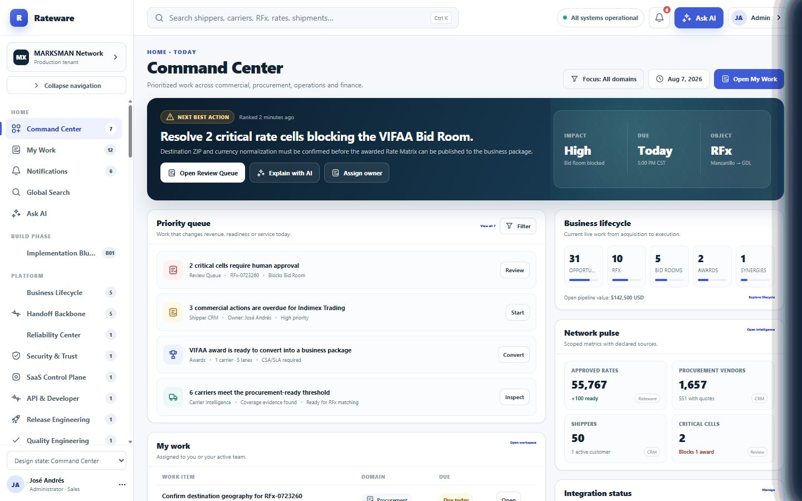
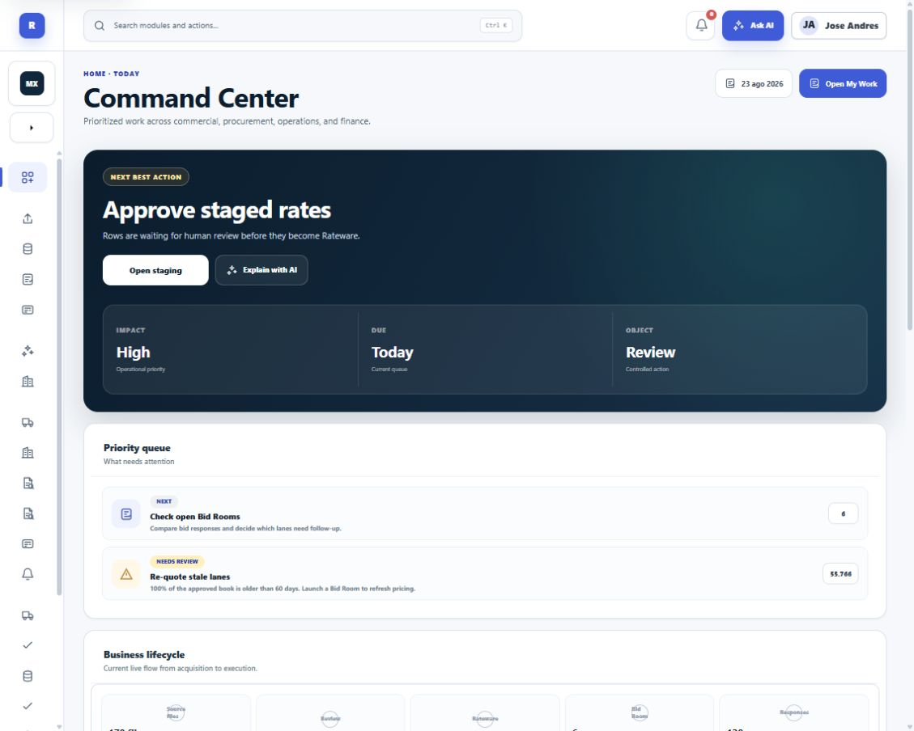
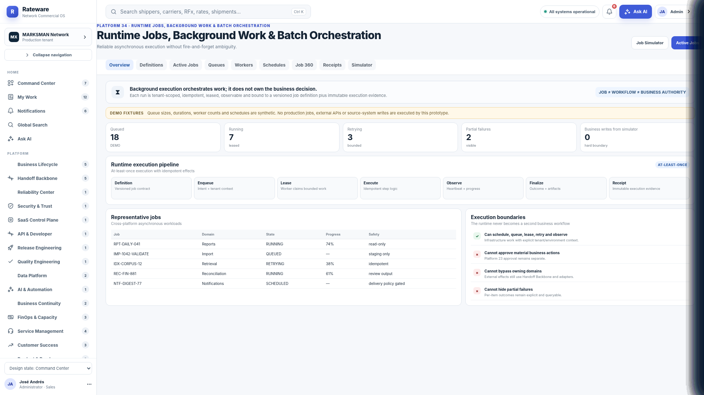
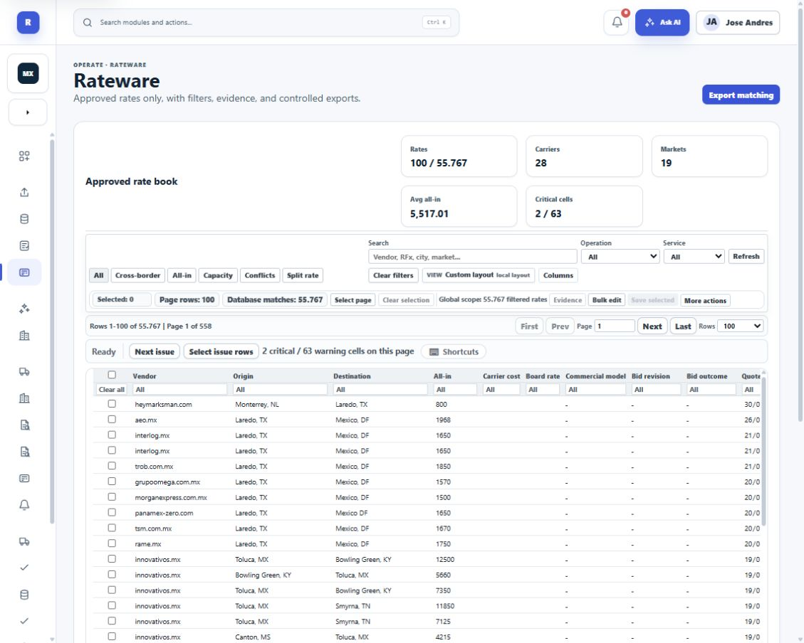
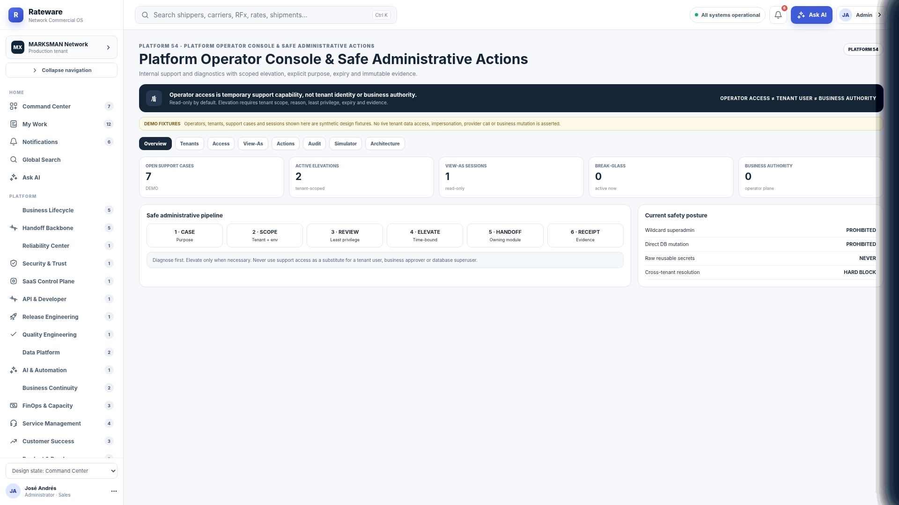
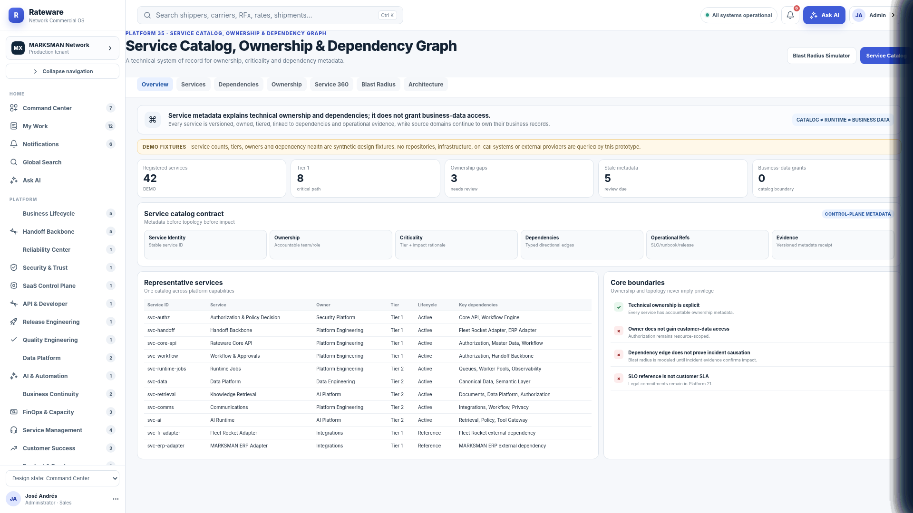
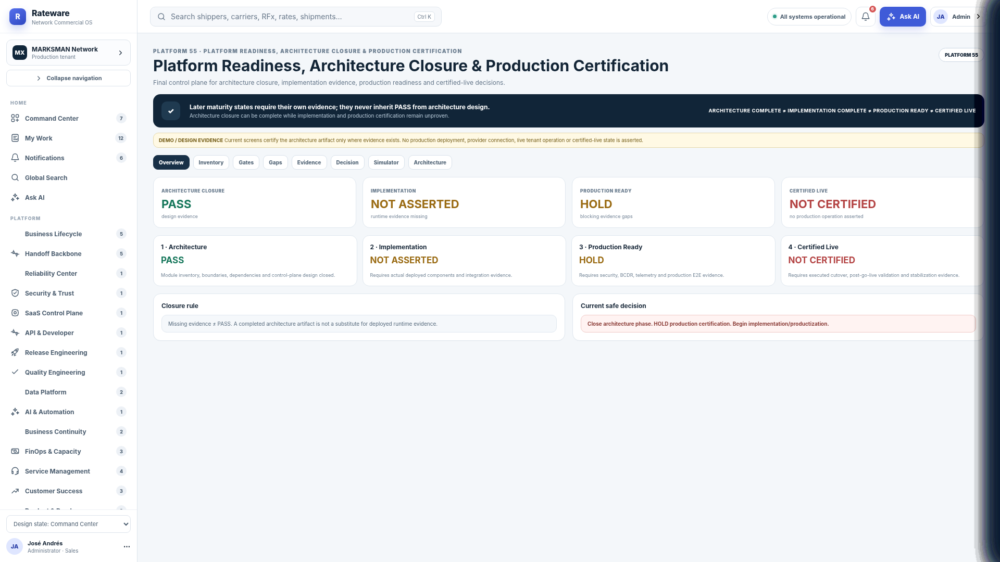

# Platform 55 Visual Parity Board

## Decision

The current Rateware product has the correct Platform 55 shell foundation, but it is not yet visually identical across route interiors. This board makes that gap explicit and measurable.

The target is **system-identical, content-adapted fidelity**: keep real Rateware data and business behavior, while matching Platform 55 composition, typography, spacing, tokens, components, responsive behavior, and states.

## Visible baseline

### Command Center — approved reference

### Command Center — current production

The current Command Center is directionally close. The remaining work is proportion, density, typography rhythm, and component-level fidelity.

### Governed operations — Platform 55 reference

### Rateware — current production

The current Rateware page uses the shell but retains a legacy interior: repeated chip/tool rows, weak hierarchy, over-dense borders, and a table that visually dominates without the reference system's context, metrics, tabs, and safety framing.

## Supporting Platform 55 archetypes

### Administration and safe actions

### Catalog and registry workspaces

### Intelligence, readiness, and decision evidence

## Content-addressed sources

| Local board file | Original source | Dimensions | SHA-256 |
|---|---|---:|---|
| `reference-command-center-1440x900.png` | approved Platform 55 shell reference | 1440x900 | `C33772B6A7BE35408606044AC222C1CA9BAE2BFEA662EB21F72E8AF3298B40C3` |
| `reference-runtime-jobs-1920.png` | `2806_platform_runtime_jobs_overview_1920.png` | 1920x1080 | `51BD248D9A9250090FB3769A188BFF7D3A4BE6C424478681F3C54CD119719CBC` |
| `reference-service-catalog-1920.png` | `2857_platform_service_catalog_overview_1920.png` | 1920x1080 | `FA7C3A169132E7C23C7273BF3716408B0A87B3084A8EEBD88757EE5151ACF5C7` |
| `reference-operator-console-1920.png` | `3982_platform_operator_console_overview_1920.png` | 1920x1080 | `E904E9C46F9AB1961A45CCFB2A878A56808095EE5DCD8618FC1B62906B2C2634` |
| `reference-readiness-1920.png` | `4043_platform_readiness_overview_1920.png` | 1920x1080 | `29484A0ED0684D651A5F46BF3D2252C9C58FD619580B64BCC551A0DE01A15B59` |
| `current-rateware-production-1129x904.png` | authenticated production capture, 2026-08-23 | 1129x904 | `C4CABFFD23404E49465A3B9D293772EE0FB21B4FA6933ADD7D71372F6E1AC3AA` |
| `current-command-center-production-1129x904.png` | authenticated production capture, 2026-08-23 | 1129x904 | `460E6CE66B11B534D6711752F3F99F000D8D567566C43BFA01E3F9FECC43914A` |

## Progress

- Formal release progress: General `83%`; P0-P2 `100%`; P3-P5 `0%`.
- P3-V visual parity track: `10%` after this source, route, and scoring contract is independently accepted.
- First implementation vertical: Command Center + Rateware.

The canonical route board is [`p3v-route-matrix.csv`](p3v-route-matrix.csv). No route is considered visually complete merely because it uses the shared shell.

References beginning with `source://rateware/` are package-relative pointers under the hash-verified extracted source root `C:\Users\andre\Downloads\rateware`. They are discovery pointers only. Each migration wave must copy or render its selected targets into a content-addressed in-repository evidence folder before the route can move from `unscored` to `accepted`.
