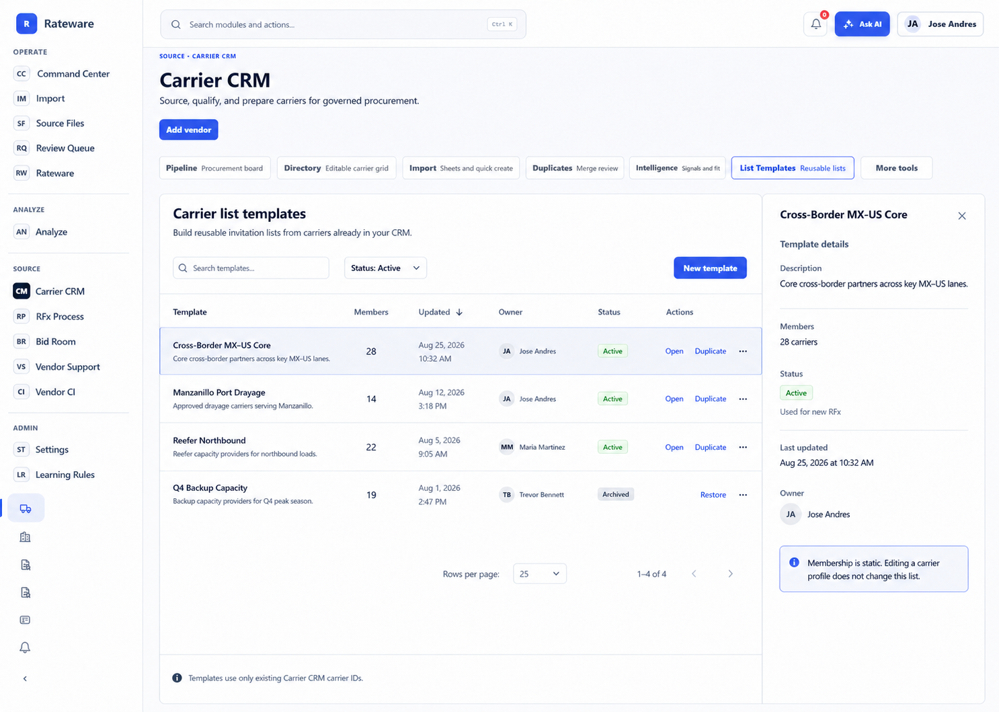
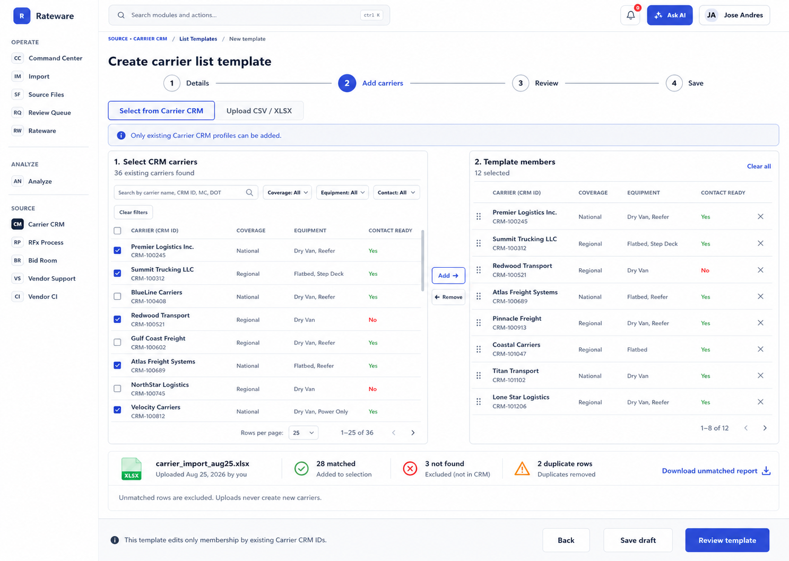
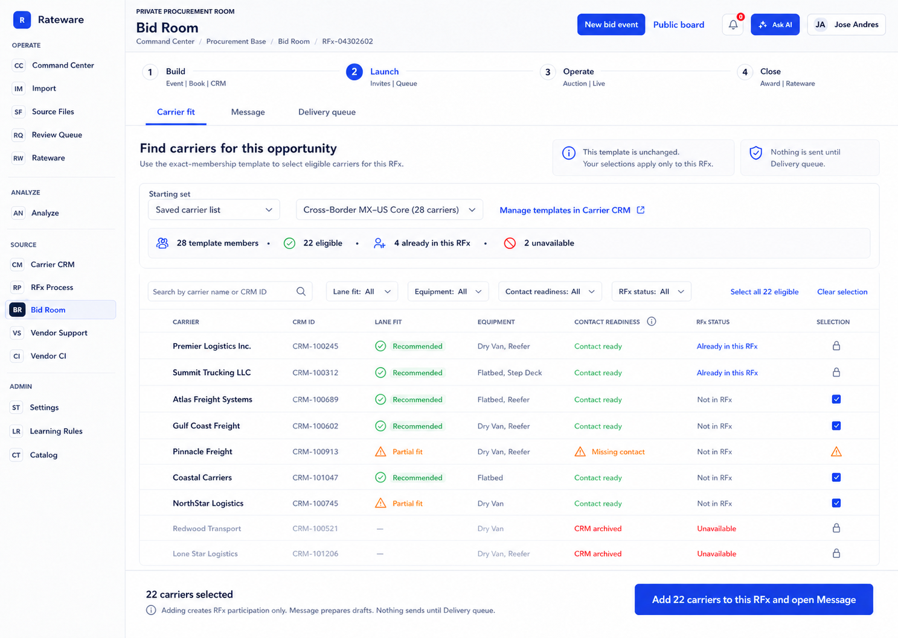

# Carrier List Templates para Carrier Fit — Diseño

**Fecha:** 2026-08-25

**Estado:** implementación completa y componentes verificados localmente; pendiente de smoke integrado autenticado en no producción y del release autorizado

**Producto:** Rateware — Carrier CRM y Bid Room

## 1. Resultado de negocio

Permitir que el equipo construya, guarde, cargue, modifique, duplique y archive listas reutilizables de transportistas ya existentes en Carrier CRM. Las listas se usan como templates dentro de `Bid Room > Launch > Carrier fit` para preparar una selección controlada de carriers que se agregarán a un RFx.

El template define una membresía exacta y estática de carriers mediante sus IDs de Carrier CRM. Cargar un template no crea carriers, no modifica perfiles del CRM, no agrega carriers al RFx y no envía invitaciones. El operador conserva una decisión humana explícita antes de agregar carriers al RFx y otra compuerta antes de enviar desde Delivery queue.

## 2. Decisiones aprobadas

- `List Templates` será un workspace dentro de Carrier CRM, no un módulo de la navegación global.
- Los templates son compartidos por workspace/organización.
- Sólo usuarios con `vendors:manage` pueden crear, modificar, duplicar, archivar o restaurar templates.
- Los templates contienen exclusivamente carriers existentes en el mismo Carrier CRM y workspace.
- La membresía es estática: los cambios posteriores en cobertura, contacto o estado del carrier no alteran automáticamente el template.
- Se podrá construir la membresía seleccionando carriers del CRM o cargando un archivo CSV/XLSX para resolver carriers ya existentes.
- Filas sin match, ambiguas o duplicadas se excluyen y se reportan; una carga nunca crea un carrier.
- Carrier Fit usa el template como `Starting set`, recalcula elegibilidad para el RFx actual y permite seleccionar todos los elegibles o sólo un subconjunto.
- Elegir un template no selecciona ni agrega carriers automáticamente.
- La acción final de Carrier Fit será `Add {N} carriers to this RFx and open Message`.
- Message prepara borradores. Nada se envía hasta una aprobación explícita en Delivery queue.
- Archivar es reversible. No habrá hard delete desde la interfaz normal.

## 3. Fuera de alcance

- Crear carriers desde el constructor o desde una carga CSV/XLSX.
- Convertir el template en un segmento dinámico por reglas.
- Editar perfiles, contactos, cobertura o equipo de un carrier desde el template.
- Cambiar la membresía del template desde Carrier Fit.
- Agregar carriers al RFx al seleccionar el template.
- Preparar o enviar mensajes desde Carrier CRM.
- Enviar invitaciones desde Carrier Fit.
- Promover un deployment o ejecutar una migración de producción como parte del diseño.

## 4. Línea base existente

Rateware ya tiene una base funcional que debe reutilizarse:

- `vendor_segments` admite `segment_type = 'participant_template'` y una lista exacta `vendor_ids uuid[]`.
- Bid Room Build/Participants permite actualmente guardar, cargar, actualizar y eliminar una lista de participantes.
- Carrier Fit ya incluye `Saved carrier list` como Starting set y excluye carriers que ya participan en el RFx.
- La acción de agregar participantes crea las filas del RFx, selecciona esos carriers como audiencia de la siguiente ola y abre Message.
- Delivery queue conserva la compuerta de envío.
- Carrier CRM tiene `Saved vendor lists`, pero esa superficie administra segmentos por criterios y no templates de membresía exacta.

La entrega debe consolidar el flujo de templates en Carrier CRM, mantener los segmentos dinámicos existentes separados y retirar las acciones duplicadas de creación/eliminación en Build/Participants.

## 5. Arquitectura de experiencia

### 5.1 Carrier CRM — biblioteca

Ruta conceptual: `Carrier CRM > List Templates`.

La biblioteca muestra templates activos, drafts y archivados con:

- nombre y descripción;
- cantidad exacta de miembros;
- última modificación;
- creador o último editor;
- estado;
- acciones Open, Duplicate, Archive o Restore.

Controles principales:

- búsqueda por nombre o descripción;
- filtro por estado;
- `New template` como única acción primaria;
- panel de detalle de la fila seleccionada.

La interfaz debe explicar que la membresía es estática y que editar el perfil de un carrier no cambia la lista.

### 5.2 Carrier CRM — constructor

El constructor usa cuatro pasos:

1. `Details` — nombre y descripción.
2. `Add carriers` — selección desde CRM o carga CSV/XLSX.
3. `Review` — miembros exactos, excepciones y cambios.
4. `Save` — activar el template o conservarlo como draft.

En `Add carriers`, el panel izquierdo muestra carriers del workspace con búsqueda y filtros. El panel derecho muestra la membresía exacta del template. Agregar o remover miembros sólo modifica el draft del template; nunca el carrier.

La carga CSV/XLSX produce un preview antes de guardar:

- matched;
- not found;
- ambiguous;
- duplicate rows;
- reporte descargable de excepciones.

El operador puede resolver una fila ambigua buscando y eligiendo manualmente un carrier existente. Una fila no resuelta permanece excluida.

### 5.3 Bid Room — Carrier Fit

Carrier Fit conserva los workspaces `Carrier fit`, `Message` y `Delivery queue`.

Flujo:

1. El operador selecciona `Saved carrier list` como Starting set.
2. Selecciona un template activo; sus miembros se cargan automáticamente como candidatos.
3. Rateware calcula el estado actual de cada miembro para este RFx.
4. La tabla muestra elegibles, ya incluidos, sin contacto y no disponibles.
5. El operador selecciona carriers individuales o `Select all {N} eligible`.
6. La acción `Add {N} carriers to this RFx and open Message` agrega sólo la selección válida.
7. Message abre con los carriers recién agregados seleccionados para preparar los borradores.
8. Delivery queue conserva la decisión explícita de preparación y envío.

El template queda inalterado durante todo este flujo.

Los números del wireframe son datos ilustrativos. La implementación debe presentar categorías mutuamente excluyentes —eligible, already in RFx, missing contact y unavailable— cuya suma coincida con el total de miembros del template.

## 6. Estados y reglas del dominio

### 6.1 Template

Estados canónicos:

- `draft` — guardado, pero no disponible en Carrier Fit;
- `active` — disponible como Starting set;
- `archived` — oculto en Carrier Fit y recuperable desde la biblioteca.

Reglas:

- Un draft requiere nombre, pero puede guardarse sin miembros.
- Activar requiere nombre único dentro del workspace y al menos un carrier válido.
- Archivar no afecta RFx existentes ni selecciones ya materializadas.
- Restaurar conserva la membresía exacta y vuelve a evaluar miembros eliminados o archivados como excepciones.
- Duplicar crea un nuevo draft con nuevos ID, nombre editable y la misma membresía inicial.

### 6.2 Membresía

- La fuente de verdad es una colección ordenada y sin duplicados de UUIDs de `vendors`.
- Todos los UUIDs deben pertenecer a la misma `organization_id` del template.
- Guardar falla de forma cerrada si el payload contiene un UUID de otro workspace.
- Un carrier eliminado o archivado después de guardar no desaparece silenciosamente del template: se muestra como excepción no seleccionable.
- Modificar datos del carrier no cambia la lista, pero Carrier Fit siempre usa los datos vigentes para elegibilidad.

### 6.3 Resolución de una carga

La resolución es determinista y nunca escribe en `vendors`:

1. `vendor_id` o `crm_id` UUID exacto dentro del workspace.
2. Identificador regulatorio exacto y único, cuando esté disponible.
3. Correo exacto y único normalizado.
4. Un nombre exacto normalizado sólo se presenta como candidato; requiere confirmación humana antes de agregarse.

Una coincidencia múltiple, sólo aproximada o perteneciente a otro workspace es `ambiguous` o `not_found` y se excluye. El preview registra la razón por fila.

### 6.4 Elegibilidad en Carrier Fit

Un miembro es elegible para la siguiente ola cuando:

- pertenece al workspace;
- su perfil está activo y disponible;
- todavía no participa en el RFx;
- tiene por lo menos un contacto de entrega utilizable;
- cumple los filtros de Carrier Fit aplicados por el operador.

Estados visibles:

- `eligible` — seleccionable;
- `already_in_rfx` — visible, bloqueado y no duplicable;
- `missing_contact` — visible con advertencia y no seleccionable para la ola;
- `unavailable` — archivado, eliminado o fuera de alcance; visible y bloqueado;
- `filtered_out` — no aparece con los filtros actuales, pero no cambia la membresía del template.

## 7. Modelo de datos

Se reutiliza `public.vendor_segments` para evitar una migración paralela de templates.

Para filas `segment_type = 'participant_template'`:

- `organization_id` será la frontera de autorización y compartición.
- `vendor_ids` conserva la membresía exacta.
- se añadirá `lifecycle_status` con `draft | active | archived`;
- se añadirá `template_version` entero para control optimista;
- se añadirán `created_by_user_id`, `created_by_email`, `updated_by_user_id`, `updated_by_email`;
- se añadirán `archived_at`, `archived_by_user_id`, `archived_by_email`.

Los campos heredados `owner_user_id` y `owner_email` se conservarán durante la compatibilidad, pero no serán la frontera de acceso individual. Los segmentos `segment_type = 'dynamic'` mantendrán su comportamiento y semántica actual.

Restricciones requeridas:

- `organization_id` no nulo para todo participant template, incluido draft, active o archived;
- nombre no vacío;
- nombre normalizado único por organización;
- `vendor_ids` sin duplicados;
- un template activo debe tener al menos un miembro;
- `template_version >= 1`;
- estado de ciclo de vida limitado a sus tres valores.

## 8. API y permisos

La API expondrá comandos explícitos de template sobre la tabla existente:

- list/get templates;
- resolve upload members;
- create draft or active template;
- update with expected version;
- duplicate;
- archive;
- restore.

Reglas de autorización:

- lectura y uso de templates activos: usuario autenticado del mismo workspace con acceso a Carrier CRM/Bid Room;
- crear, actualizar, duplicar, archivar o restaurar: `vendors:manage` validado en backend;
- ningún `organization_id`, owner o permiso enviado por el navegador se acepta como autoridad;
- todas las consultas y mutaciones se filtran por la organización resuelta desde la sesión.

Actualizar requiere `expected_version`. Si otro usuario modificó el template, la API responde `409 Conflict`, no sobrescribe cambios y devuelve metadata suficiente para recargar y comparar.

La acción de Carrier Fit debe ser idempotente por RFx, lane y carrier. Un segundo intento no crea invitaciones duplicadas ni reenvía mensajes.

## 9. Auditoría

Se registran como eventos distintos:

- create draft;
- activate;
- update details;
- add members;
- remove members;
- duplicate;
- archive;
- restore;
- load in Carrier Fit;
- add selected carriers to RFx.

Cada evento incluye request ID, organización, actor, template ID, versión anterior/nueva, conteos de miembros y resultado. Las diferencias de membresía guardan IDs agregados y removidos; no se registran datos de contacto completos en logs.

## 10. Errores y recuperación

| Condición | Comportamiento requerido |
|---|---|
| Nombre duplicado | Rechazar sin sobrescribir y ofrecer abrir el template existente |
| Template modificado por otra persona | `409`, recargar versión y conservar selección local para comparación |
| Template archivado mientras Carrier Fit está abierto | Bloquear Add, informar el cambio y permitir escoger otro Starting set |
| Carrier ya agregado al RFx por otra sesión | Recalcular como `already_in_rfx`; no duplicar |
| UUID de otro workspace | Rechazar todo el guardado y auditar intento cross-tenant |
| Archivo con filas no encontradas | Excluir filas, conservar preview y ofrecer reporte |
| Archivo con coincidencia ambigua | Exigir selección manual de un carrier CRM existente |
| Archivo duplicado | Deduplicar por vendor ID y reportar cantidad |
| Carrier archivado después de guardar | Mantenerlo visible como `unavailable`; no borrarlo del template |
| Falta de contacto | Mostrar warning y excluir de la selección de la ola |
| Error al agregar a RFx | No abrir Message; conservar selección y mostrar correlation ID |
| Add confirmado, respuesta del navegador perdida | Reconciliar idempotentemente y abrir Message sin duplicar |

## 11. Migración del flujo actual

1. Añadir columnas y constraints de lifecycle, versión y actores.
2. Backfill de participant templates existentes con `organization_id`, `active` y versión `1`.
3. Generar un reporte de templates sin workspace resoluble o con miembros inexistentes; no borrar ni corregir silenciosamente.
4. Cambiar la consulta de participant templates de scope individual por owner a scope compartido por organización.
5. Implementar API y autorización server-side con `vendors:manage`.
6. Añadir `List Templates` dentro de Carrier CRM y el constructor.
7. Integrar el selector de templates activos en Carrier Fit.
8. Convertir `Saved carrier list` y el importador heredado de Build/Participants en un enlace a Carrier CRM; no mantener dos editores.
9. Ocultar hard delete de la interfaz y sustituirlo por archive/restore.
10. Habilitar mediante un flag de release y validar primero en un entorno no productivo.

## 12. Estrategia de pruebas

### 12.1 Dominio y API

- normalización y unicidad de nombres;
- deduplicación estable de UUIDs;
- validación de todos los miembros contra la organización;
- resolución de CSV/XLSX para matched, ambiguous, not found y duplicates;
- aislamiento real entre dos organizaciones;
- autorización negativa sin `vendors:manage`;
- create, update, duplicate, archive y restore;
- conflicto de versión con dos editores;
- auditoría de cambios de membresía;
- idempotencia al agregar carriers al RFx.

### 12.2 Interfaz

- biblioteca con filtros de active, draft y archived;
- creación desde selección CRM;
- creación desde archivo con preview y reporte;
- edición sin mutar perfiles de carrier;
- archivo reversible;
- template archivado ausente en Carrier Fit;
- carga automática de miembros al elegir template;
- conteos de eligible, already in RFx, missing contact y unavailable;
- carriers bloqueados no seleccionables por mouse o teclado;
- selección parcial y `Select all eligible`;
- CTA abre Message con sólo los carriers recién agregados;
- Delivery queue permanece como única superficie de envío;
- foco, labels, estados de error y navegación por teclado.

### 12.3 Regresión

- segmentos dinámicos existentes conservan filtros y resultados;
- Starting sets Recommended, Procurement y All active siguen funcionando;
- RFx existentes no cambian al archivar o editar un template;
- historial previo de invitaciones, respuestas y bids permanece intacto;
- ninguna prueba de navegador envía comunicaciones reales.

## 13. Criterios de aceptación

1. Un usuario con `vendors:manage` puede crear un template seleccionando carriers existentes.
2. Puede cargar CSV/XLSX y guardar únicamente matches confirmados del CRM.
3. Una carga nunca crea, actualiza o archiva un carrier.
4. Otro usuario autorizado del mismo workspace ve y puede modificar el template.
5. Un usuario de otra organización no puede leerlo ni inferir su existencia.
6. Una edición concurrente no sobrescribe silenciosamente otra versión.
7. El template puede duplicarse, archivarse y restaurarse con auditoría.
8. Sólo templates activos aparecen en Carrier Fit.
9. Elegir un template muestra su membresía exacta y recalcula elegibilidad sin modificarlo.
10. Ya incluidos, sin contacto y no disponibles son visibles pero no seleccionables.
11. El operador puede seleccionar todos los elegibles o un subconjunto.
12. `Add {N} carriers to this RFx and open Message` no crea duplicados y abre Message con la audiencia correcta.
13. Cargar o agregar carriers no prepara ni envía mensajes automáticamente.
14. Delivery queue conserva la aprobación humana de envío.
15. El editor heredado en Build/Participants deja de ser una segunda fuente de verdad.

## 14. Resultado esperado

Carrier CRM se convierte en la única fuente de verdad para listas reutilizables de carriers. Bid Room consume esas listas sin alterarlas, Carrier Fit conserva la selección humana y Message/Delivery queue mantienen separadas la preparación y la ejecución de las invitaciones.

## 15. Handoff de release — 2026-08-26

La implementación está aislada en `codex/carrier-list-templates`. No se ha hecho push, migración remota, deployment de producción ni activación del flag.

Evidencia cerrada antes del handoff:

- la migración completa se aplicó en Supabase local PostgreSQL 17;
- un probe transaccional con dos organizaciones validó constraints, grants, RLS, RPCs, orden estable, scope de workspace, conflicto de versión y journal; terminó en `ROLLBACK`;
- el preview simulado en navegador validó Library → Builder → Carrier Fit → Message, creación sólo desde carriers CRM, preview de archivo, lifecycle, cuatro estados de elegibilidad, selección parcial y las compuertas de Message/Delivery; el smoke integrado autenticado queda en la secuencia no productiva;
- el navegador terminó con cero errores o warnings y el verificador local confirmó cero primitivas de red en el preview;
- las suites enfocadas, Deno check, action contract, Rateware stability y Bid Room multi-lane pasan;
- el `npm test` raíz conserva el mismo stop de la línea base en P3-V2 closure: `e3e1c0b...` no es ancestro del squash productivo;
- `supabase db advisors --local` no encontró errores; conserva dos warnings preexistentes ajenos a este feature;
- `supabase db lint --local` conserva un error preexistente ajeno a este feature: `consolidate_exact_workspace_vendor_duplicates` referencia `public.rates`, tabla ausente en la pila local.

Orden autorizado posteriormente, sin ejecutarlo desde este handoff:

1. Push/revisión de la rama y merge del commit aprobado.
2. Aplicar la migración en un ambiente no productivo y verificarla.
3. Desplegar API y estáticos con `CARRIER_LIST_TEMPLATES_V2_ENABLED=false`.
4. Ejecutar smoke autenticado y probes de tenant/permisos en no producción.
5. Activar el flag sólo en no producción y repetir Carrier CRM → Carrier Fit → Message.
6. Obtener autorización explícita para migración, deploy y flag de producción.
7. Aplicar migración y desplegar en producción manteniendo el flag apagado; ejecutar smoke.
8. Activar el flag durante la ventana aprobada y monitorear auditoría/errores antes de declarar disponibilidad.
